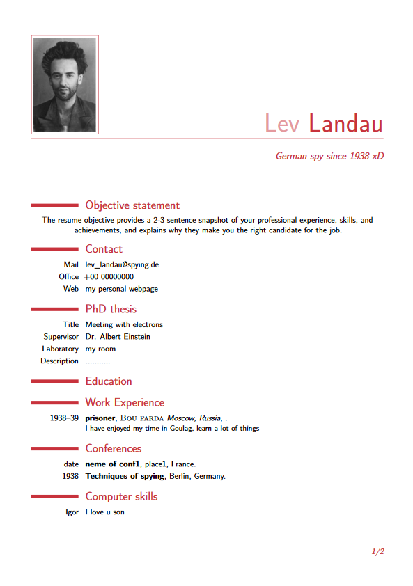

# LaTeX-template-for-a-CV-resume


## Description
A template for a simple and clean academic curriculum vitae (CV) written using LaTeX. To get an idea of the final output. Please check the uploaded PDF example of Lev Landau's CV or the screenshots below.


## Usage
You just have to clone the repository and edit it locally or within a web tex compiler. Of course, you are free to customize the style files as you want. To run it locally:
<be>
```sh
pdflatex main.tex
```


## Screenshots

<p align="center">
    
</p>


## Support and Contributing
Let me know if you have any suggestions/ideas to enhance those scripts or add further settings. Your suggestions are warmly welcomed.
<br>
In case of a problem, It is strongly recommended to post an issue. For a more confidential demand, don't hesitate to email me.


